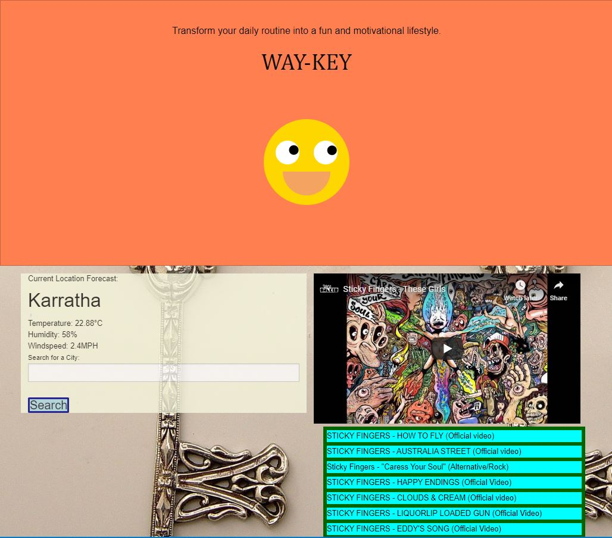
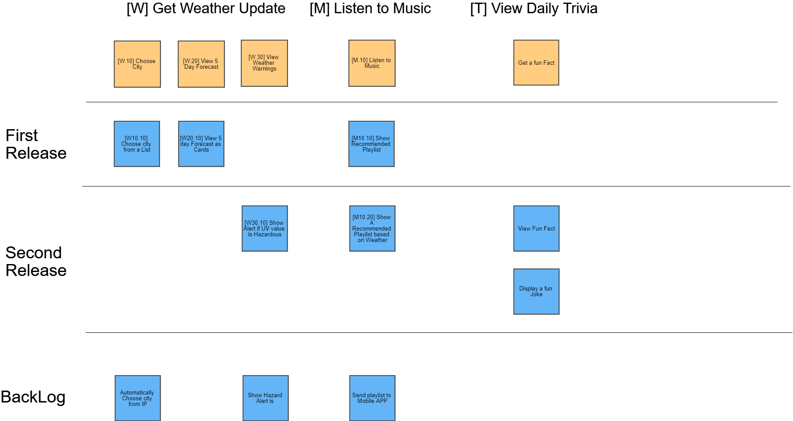

Project Way-Key:
Way-Key is an innovative program which automatically tracks your location, and provides you with a playlist depending on what the weather is in your area. We provide you with a youtube embedded video to view your music for the day and the ability to search the weather anywhere in the world.
Also we included a joke generator. Just click the smiley face to bring a smile to yours.

https://recordsword.github.io/Way-Key/

How to use:
When you open our webpage, your location will be shown in the window where you can also search for the weather anywhere else in the world.
When the weather is determined, a playlist will be generated based on this information. You can select any of the songs listed to view.
If you want a joke, click the smiley face and a generated joke will appear on screen.

.JPG)

Technologies Utilised:
jQuery
Foundation
OpenWeather API
Youtube V3 API
OpenCage API

Authors
Chris Klinger, Veronica Lim, Nick Sword